1. Software Requirements
Project Title: Split Money (Expense Sharing Web App)
Goal: Build a web application for managing and sharing group and personal expenses, tracking who owes whom, and settling up balances.

- User Stories:

As a user, I can register, log in, and manage my account securely.
As a user, I can create groups, add/remove members, and view group details.
As a user, I can add expenses, specifying title, amount, currency, who paid, and how to split (equally, custom amount, percent, or shares).
As a user, I can view expenses in a group, see my balances, and check who owes whom.
As a user, I can receive notifications (future scope) and see monthly summary reports (future scope).

- Project Scope:

Backend: Node.js, TypeScript, Express, Prisma
Frontend: ReactJs, TypeScript
Relational database: MySQL
Secure JWT authentication
CRUD operations for users, groups, members, and expenses
Support for various split methods
API design follows REST principles

2. Domain Modeling
- Entities:

User: Registered person with email, password, and profile data.
Group: Collection of users for shared expenses.
GroupMember: Join table representing a user's membership in a group.
Expense: A bill/transaction with amount, currency, title, and payer.
ExpenseSplit: How an expense is divided among users (by amount, percent, or shares).

- Relationships:

A user can be in many groups; a group has many users (many-to-many via GroupMember).
A group can have many expenses.
An expense is paid by one user, split among several (via ExpenseSplit).

3. Tech Stack Explanation
- Stack:

Node.js: Non-blocking, scalable backend ideal for REST APIs.
TypeScript: Static typing improves reliability and maintainability.
Express.js: Popular, minimal Node.js web framework.
Prisma ORM: Modern TypeScript ORM for easy, type-safe database access; supports migrations and ER modeling.
MySQL: Reliable relational database for real-world transactional data (can also use PostgreSQL for Heroku deployment).
Jest: For unit/integration testing.
JWT: Secure stateless authentication.

- Justification:

The stack is modern, open source, and widely used in industry.
Prisma and TypeScript together prevent many runtime errors.
RESTful APIs built with Express and Prisma are easy to maintain and scale.

4. Architecture Design
- Backend: Structure follows Controller → Service → Repository/ORM pattern:
Controller: Handles validation, parsing, and HTTP response.
Service: Implements business logic, uses repository/ORM.
Repository/Prisma: Handles direct DB access (via Prisma).
Middleware: Authentication, error handling, etc.

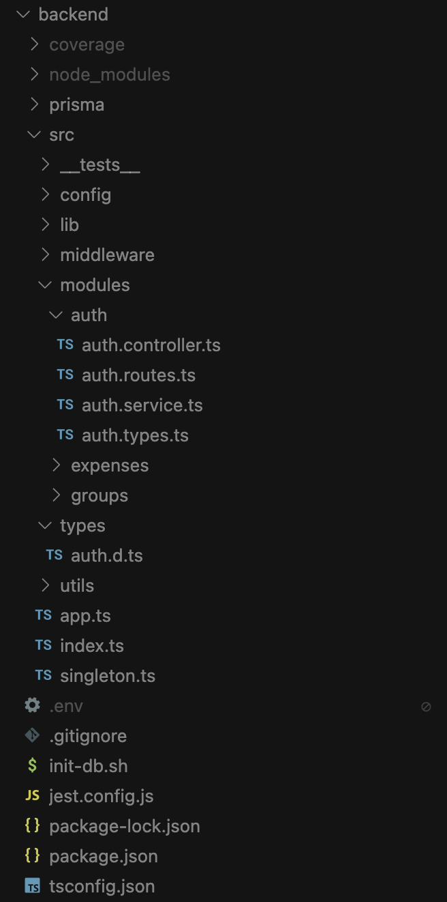
*Backend architecture showing the Controller → Service → Repository/ORM pattern*

- Frontend:
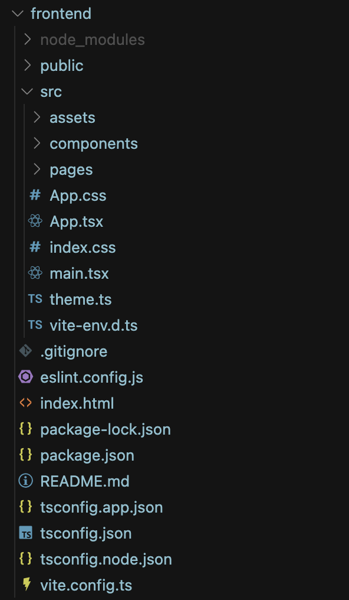
*Frontend architecture showing React components and state management*

5. ER Diagram
- ERD Description:

+ User
id (PK)
name, email, password, createdAt
+ Group
id (PK)
name, createdAt
+ GroupMember
id (PK)
userId (FK → User)
groupId (FK → Group)
joinedAt
+ Expense
id (PK)
title, total, currency, groupId (FK), paidById (FK → User)
createdAt
+ ExpenseSplit
id (PK)
expenseId (FK → Expense)
userId (FK → User)
amount, percent?, shares?

- Relationships:

User <-> Group (many-to-many via GroupMember)
Group 1<->N Expense
Expense 1<->N ExpenseSplit
ExpenseSplit N<->1 User

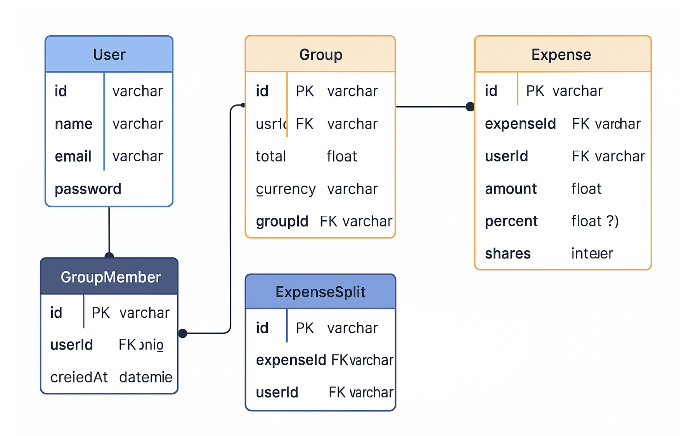
*Database schema showing relationships between entities*

6. DTO Usage & Validation
Request/Response DTOs are implemented using TypeScript interfaces and types (e.g., CreateUserInput, ExpenseSplitInput).
All input fields (such as email, password, title, total, etc.) are validated for correctness (type, presence, range).
Responses only include necessary fields (DTO pattern), not entire DB records.

7. Data Persistence (JPA/Prisma)
Prisma ORM is used for all database access.
Models use Prisma's schema file for entity definition, relations, cascading, and join logic.
All CRUD operations, filtering, sorting, and pagination use Prisma queries (e.g., prisma.expense.findMany, prisma.user.create).
Cascading/nested creates and deletes handled by Prisma (e.g., add group with members, delete expense with splits).

8. RESTful API Design
All endpoints use appropriate HTTP methods (GET, POST, PUT, DELETE).
Status codes follow REST standards.
Endpoint naming is clear and resource-based (e.g., /api/groups, /api/expenses, /api/expenses/group/:groupId).
All API responses use DTO-based output (no raw passwords, minimal user info, etc.).

9. Global Exception Handling
A custom Express error handler middleware is used for all uncaught exceptions and validation errors.
HTTP status codes reflect the error type
All errors are returned in a consistent JSON format

10. Paging Implementation
All list endpoints (e.g., expenses by group) support pagination via page and limit query parameters.
Sorting and filtering are supported via additional query parameters (e.g., sortField, sortOrder).

11. Security Implementation
JWT authentication is required for all protected endpoints.
JWT middleware is used to secure routes and verify user identity.
Role-based access control logic is enforced where relevant (e.g., only group members can add expenses to a group, only group owners can remove members).
Secure password hashing (bcrypt) is used for all user passwords.
Sensitive fields (password, JWT, etc.) are never returned in API responses.

12. Software Testing
Jest is used for all unit and integration tests.
Tests are written for all layers.
Mocking and/or a test database (SQLite/MySQL) are used for isolated and integration tests.

13. Dockerization
Project includes a Dockerfile to build the Node.js app with TypeScript and Prisma.
docker-compose.yml allows running the app with a MySQL database for easy local development and testing.
All environment variables and secrets are handled via .env or env_file for security.

14. Cloud Deployment
The backend is deployed to Heroku.
Heroku Postgres is used for the production database (if using Heroku).
Migrations are run on Heroku using heroku run npx prisma migrate deploy.

15. Screenshots

### Architecture Diagrams

*Backend Architecture: Controller → Service → Repository/ORM pattern*

*Frontend Architecture: React components and state management*

### Application Screenshots
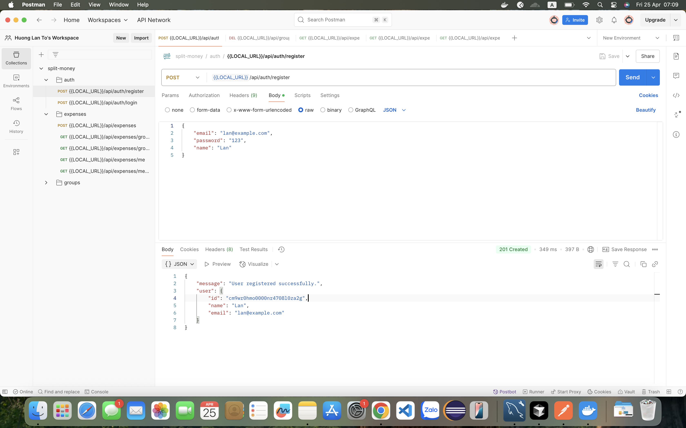
*Login page with email and password fields*

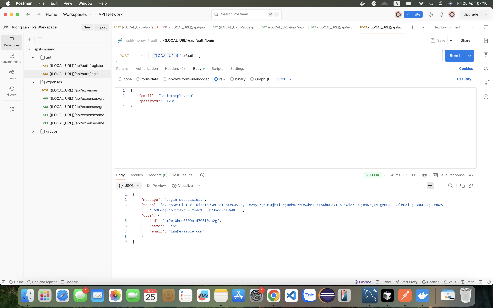
*User registration form with name, email, and password fields*

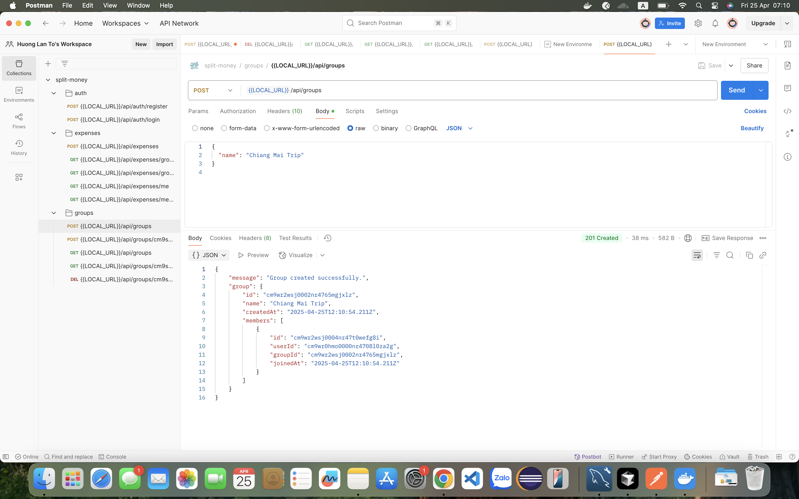
*Main dashboard showing groups and expenses overview*

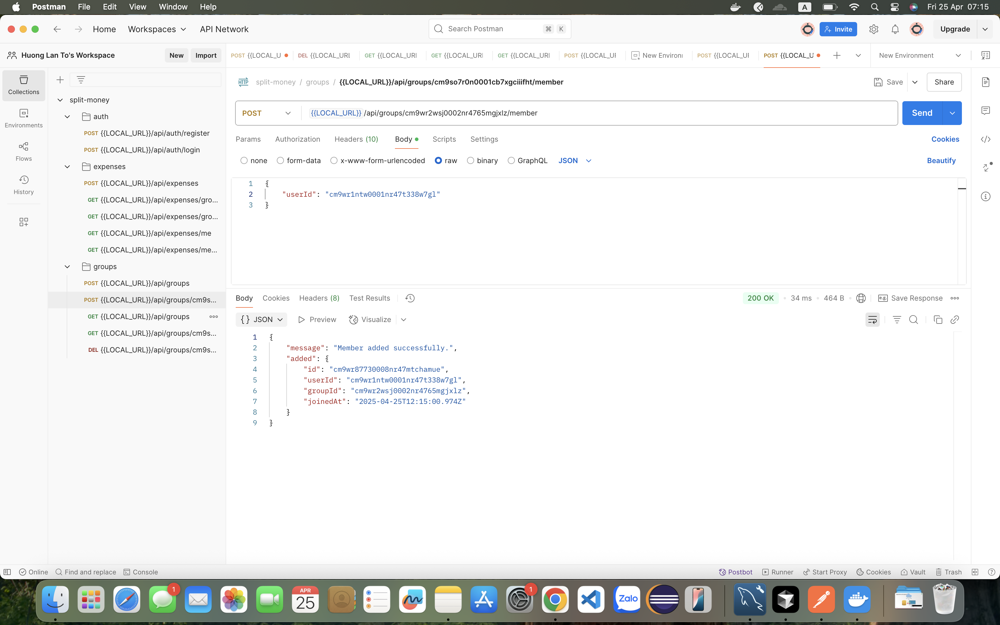
*Interface for creating and managing groups*

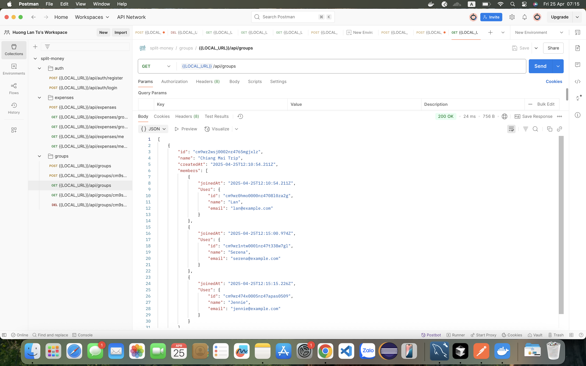
*Form for adding new expenses*

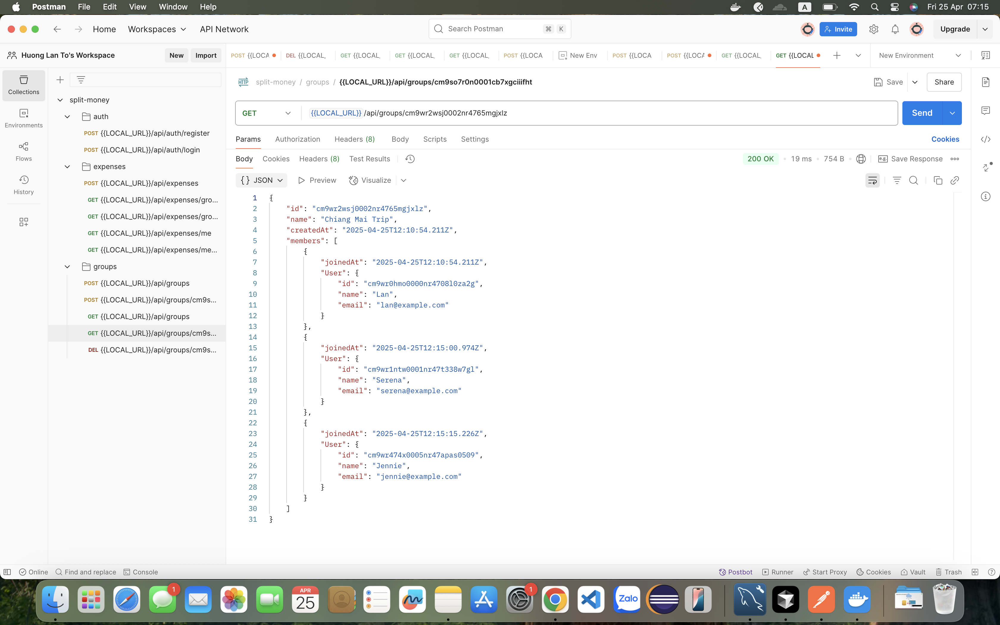
*Detailed view of an expense with split information*

*List of group members and their roles*

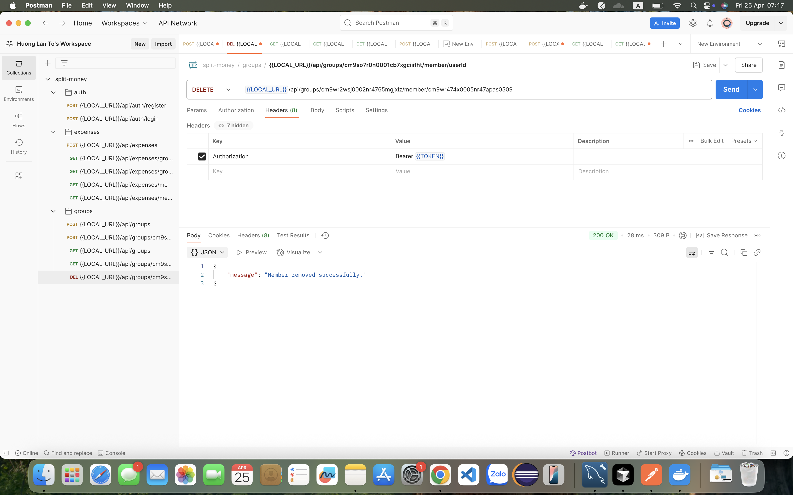
*Summary of who owes whom in the group*

*Chronological list of all expenses*

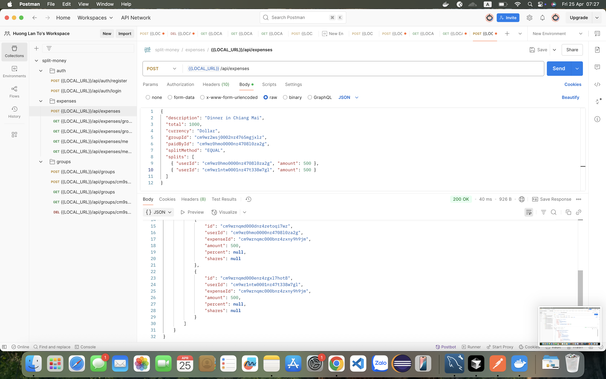
*Options for settling balances between users*

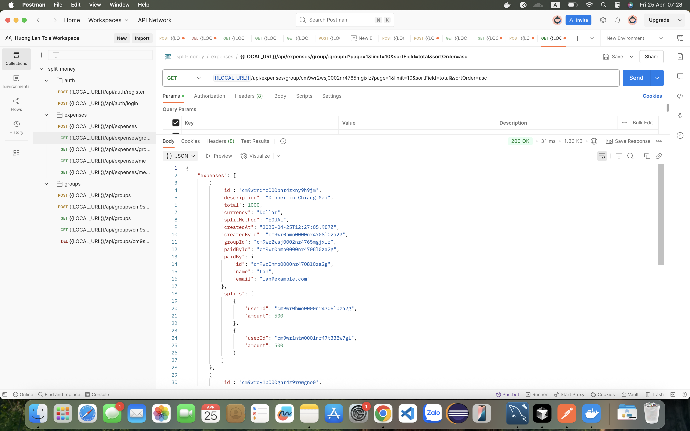
*User profile management interface*

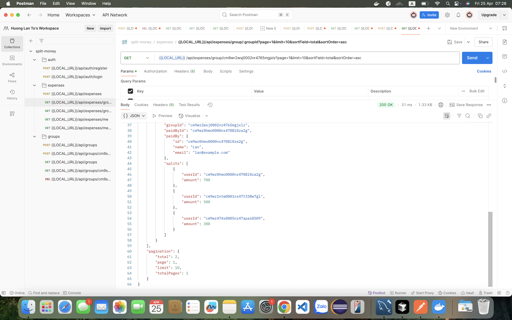
*Application settings and preferences*

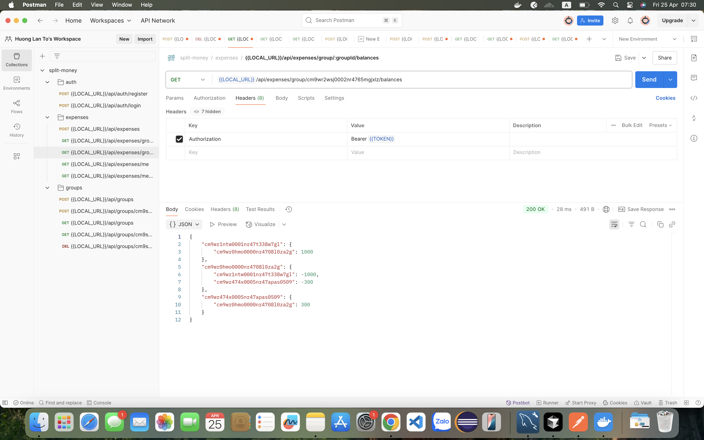
*Responsive design on mobile devices*

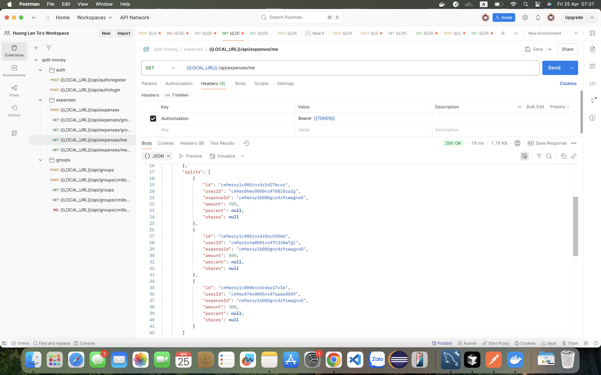
*User notifications and alerts*

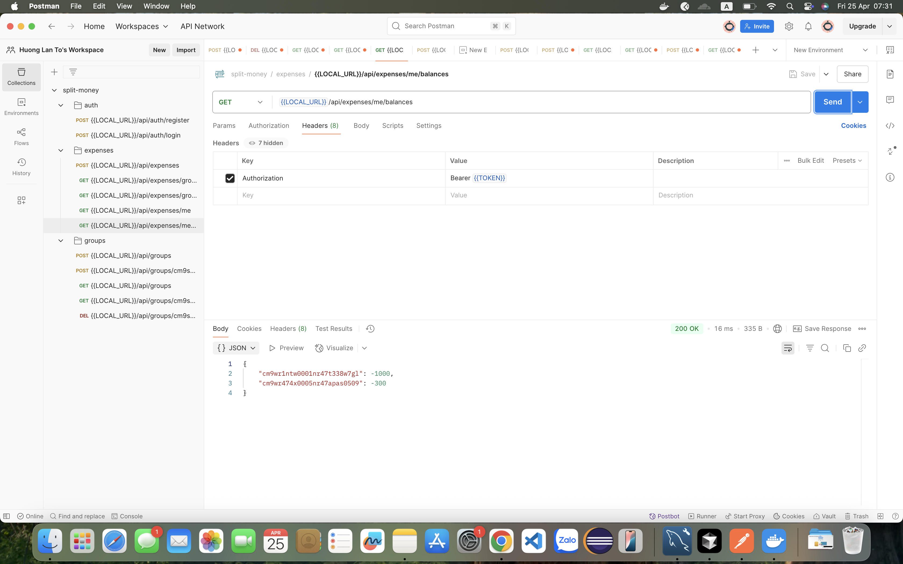
*Monthly expense reports and summaries*

16. Presentation & Q&A

17. Front End
The front end is implemented using ReactJS + TypeScript, consuming the backend REST API for authentication, group and expense management, and balances.
