# Split Money (Expense Sharing Web App) 💸

[](https://nodejs.org/)
[](https://www.typescriptlang.org/)
[](https://www.prisma.io/)
[](https://www.mysql.com/)
[](https://www.docker.com/)

---

## 📑 Table of Contents

- [Project Overview](#project-overview)
- [Quick Start](#quick-start)
- [Features](#features)
- [Tech Stack](#tech-stack)
- [Architecture](#architecture)
- [ER Diagram](#er-diagram)
- [Rubric Mapping](#rubric-mapping)
- [Screenshots](#screenshots)
- [Deployment](#deployment)
- [Testing](#testing)
- [Contributors](#contributors)

---

## 🚀 Project Overview

**Split Money** is a web application for managing and sharing group/personal expenses, tracking who owes whom, and settling up balances.

---

## ⚡ Quick Start

```sh
# Backend
cd backend
npm install
npm run dev

# Frontend
cd frontend
npm install
npm run dev

# Run backend tests
cd backend
npm test

# Or run with Docker
docker compose up --build
```

---

## ✅ Features

- Secure user registration & login (JWT)
- Create groups, manage members
- Add expenses (equal/custom/percent/shares)
- Track balances (“who owes whom”)
- View expenses by group/user with pagination, sorting, filtering
- Validation for APIs requests
- Full RESTful API (with error handling)
- Docker & cloud ready (Heroku, Azure)
- Unit/integration tests (Jest)

---

## 🏗️ Tech Stack

- **Backend:** Node.js, TypeScript, Express, Prisma ORM
- **Database:** MySQL (or Postgres for deployment)
- **Frontend:** ReactJS, TypeScript
- **Auth:** JWT (stateless sessions)
- **Testing:** Jest, Supertest
- **Deployment:** Docker, Azure

---

## 🗺️ ER Diagram

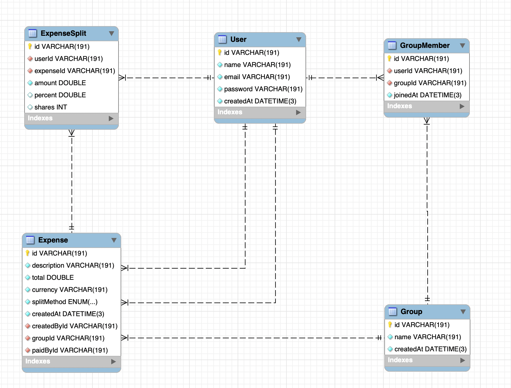
*Entity Relationship Diagram*

- **User:** id, name, email, password, createdAt
- **Group:** id, name, createdAt
- **GroupMember:** id, userId (FK), groupId (FK), joinedAt
- **Expense:** id, title, total, currency, groupId (FK), paidById (FK), splitMethod, createdAt
- **ExpenseSplit:** id, expenseId (FK), userId (FK), amount, percent, shares

---

## 🏆 Rubric Mapping

| Requirement                  | Implemented         |
|------------------------------|--------------------|
| Software Requirements        | ✅ See [Overview](#project-overview)    |
| Domain Modeling              | ✅ See [ER Diagram](#er-diagram)        |
| Tech Stack Explanation       | ✅ See [Tech Stack](#tech-stack)        |
| Architecture Design          | ✅ See [Architecture](#architecture)    |
| DTO & Validation             | ✅ TypeScript types, custom validation  |
| Data Persistence (Prisma)    | ✅ Prisma ORM, full CRUD                |
| RESTful API Design           | ✅ REST, status codes, clear endpoints  |
| Global Exception Handling    | ✅ Express error middleware             |
| Paging, Sorting, Filtering   | ✅ All list endpoints                   |
| Security (JWT, roles)        | ✅ JWT, bcrypt, role checks             |
| Software Testing (Jest)      | ✅ Unit/integration tests               |
| Dockerization                | ✅ Dockerfile & docker-compose.yml      |
| Cloud Deployment             | ✅ Azure                                |
| Screenshots & Documentation  | ✅ See [Screenshots](#screenshots)      |
| Front End                    | ✅ ReactJS + TypeScript                 |

---

## 📸 Screenshots

- **Login:**  
  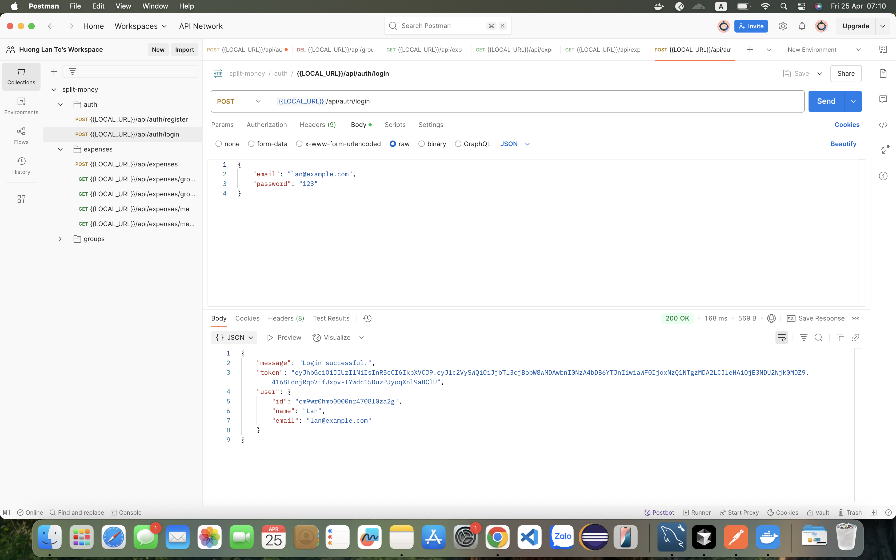
- **Registration:**  
  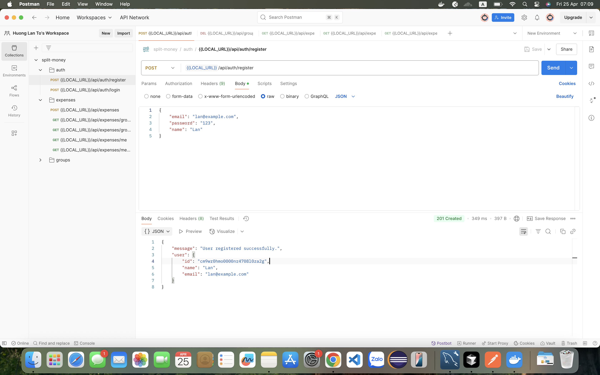
- **Groups:**  
  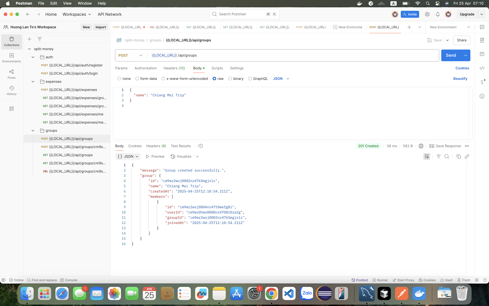
  
  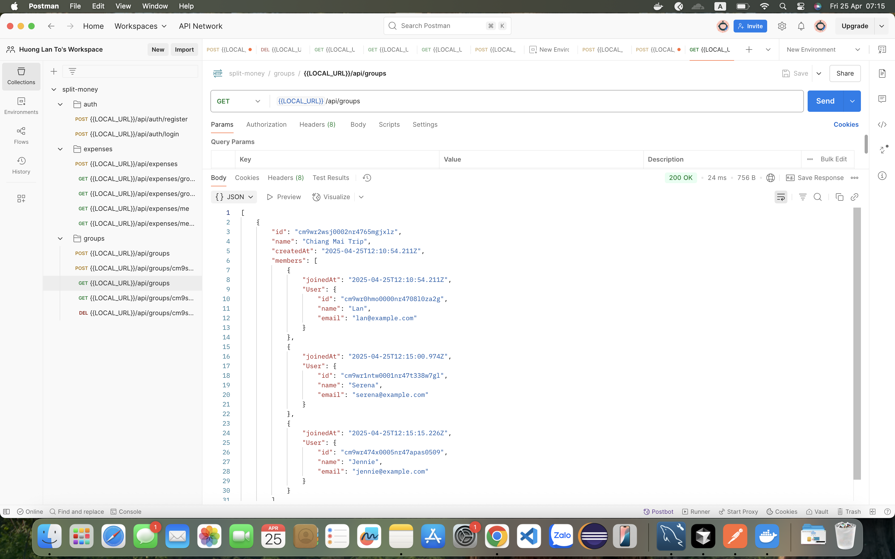
  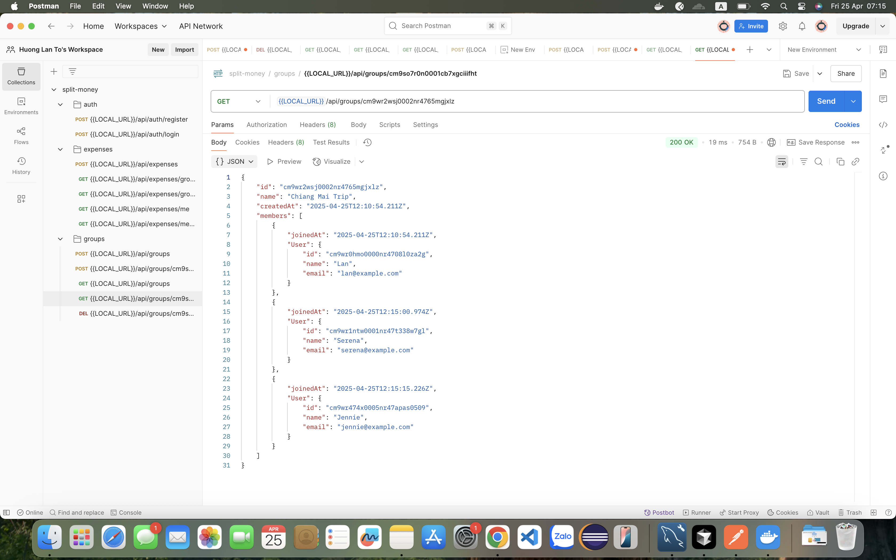
  
- **Expenses:**  
  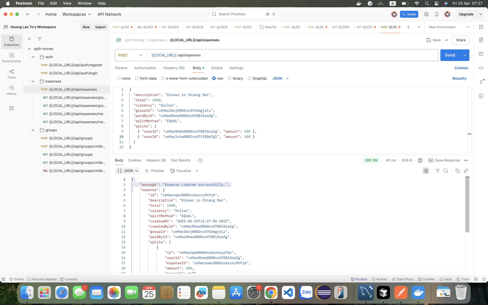
  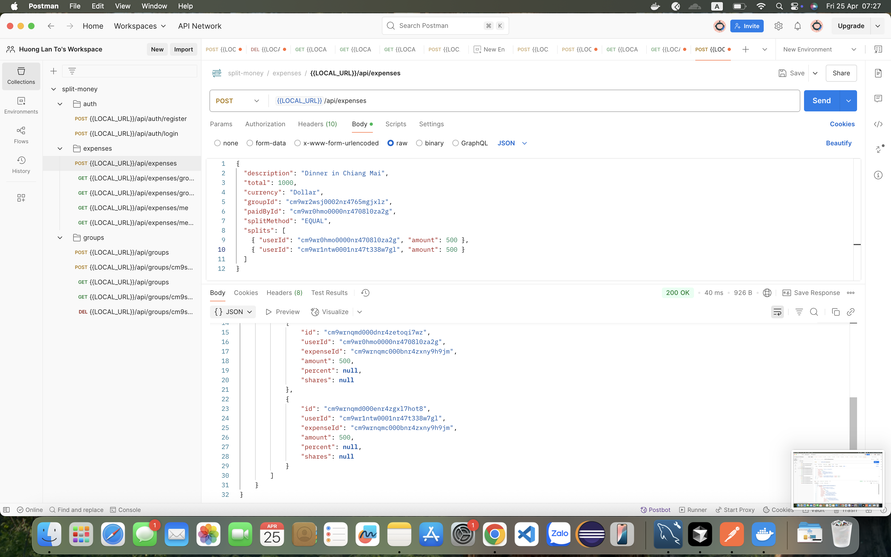
  
  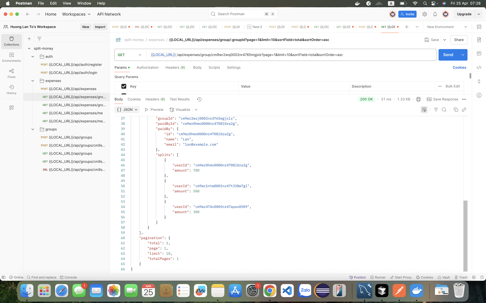
  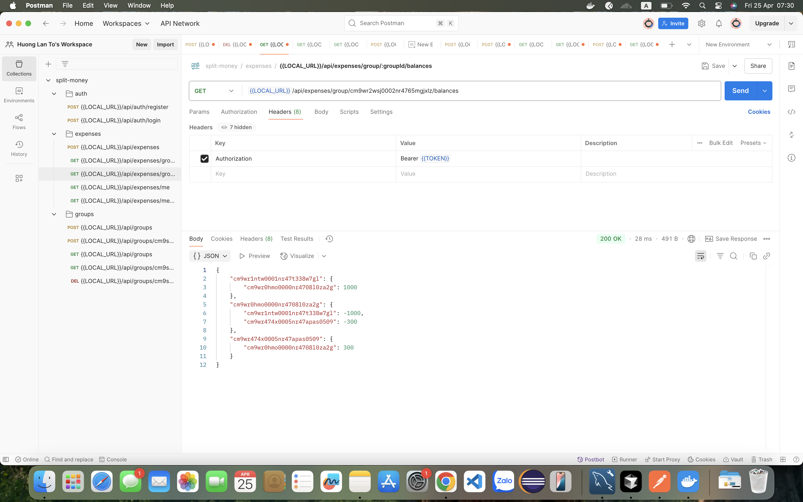
  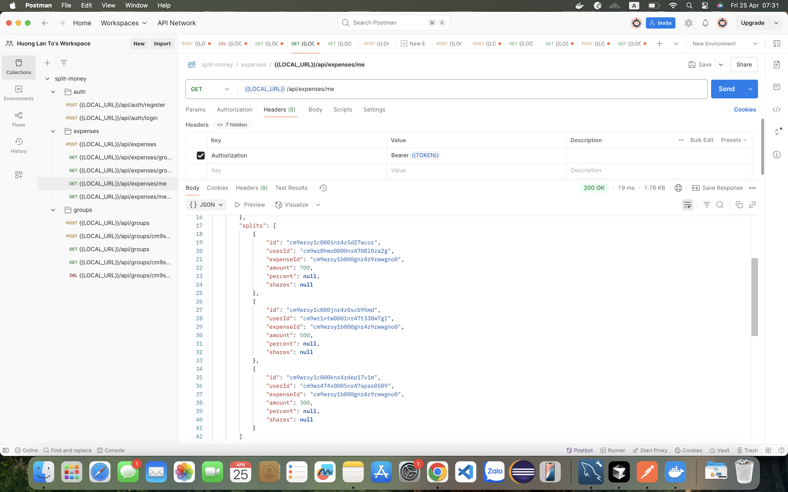
  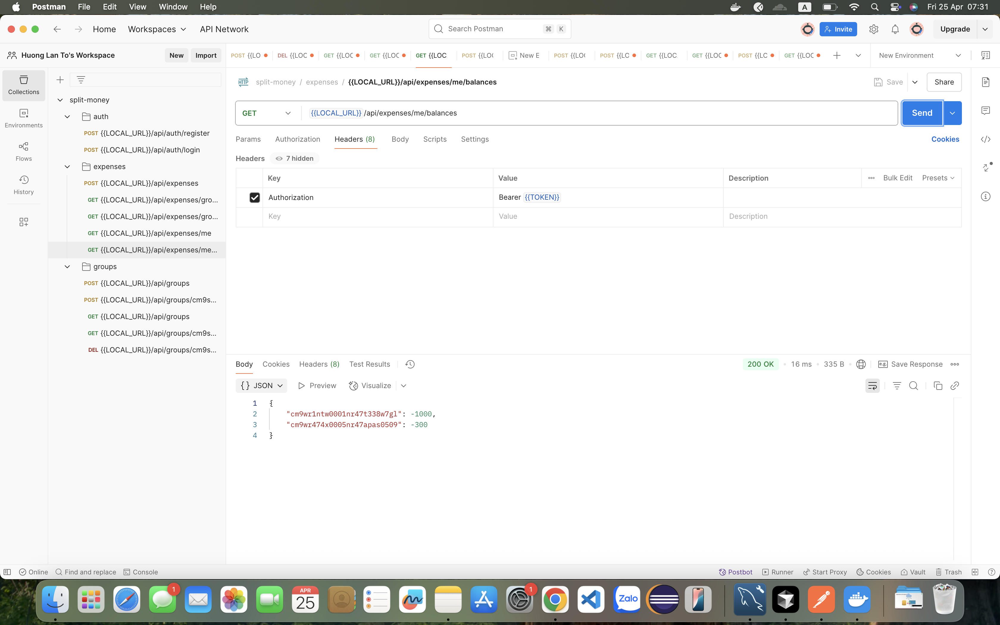

---

## ☁️ Deployment

**Backend:**  
[https://splitmoney-app.azurewebsites.net](https://splitmoney-app.azurewebsites.net)

- Production database: Azure Database for MySQL
- Env vars (`DATABASE_URL`, `JWT_SECRET`, etc.) set via portal

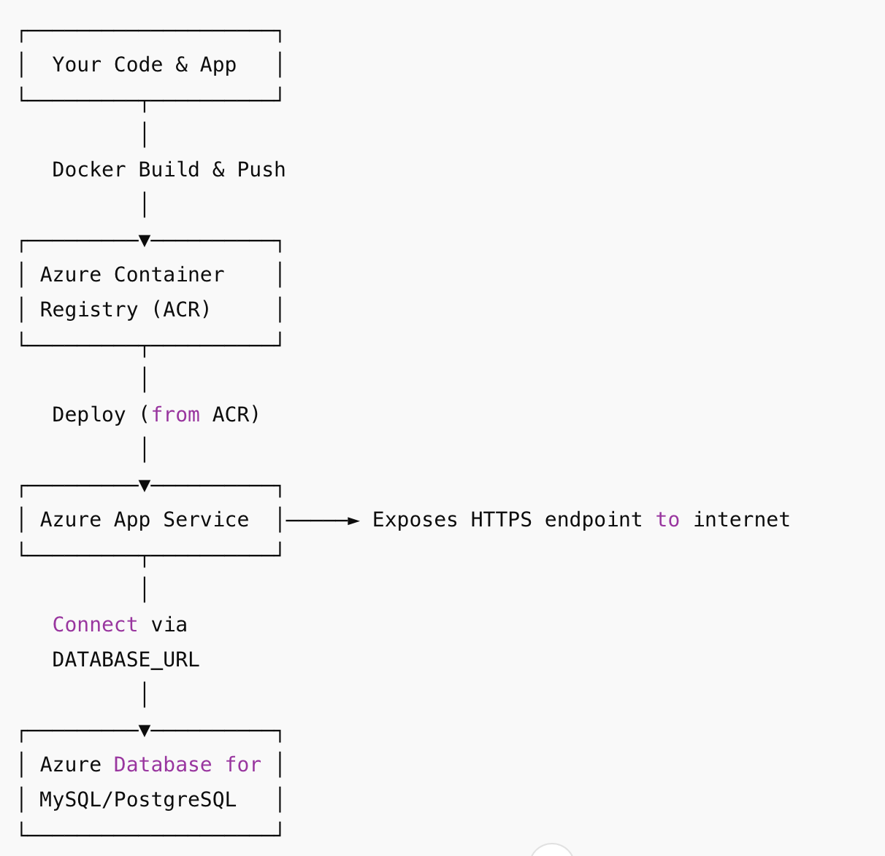
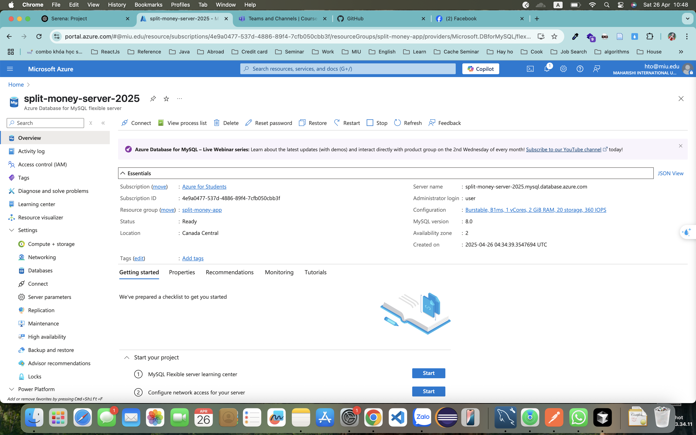
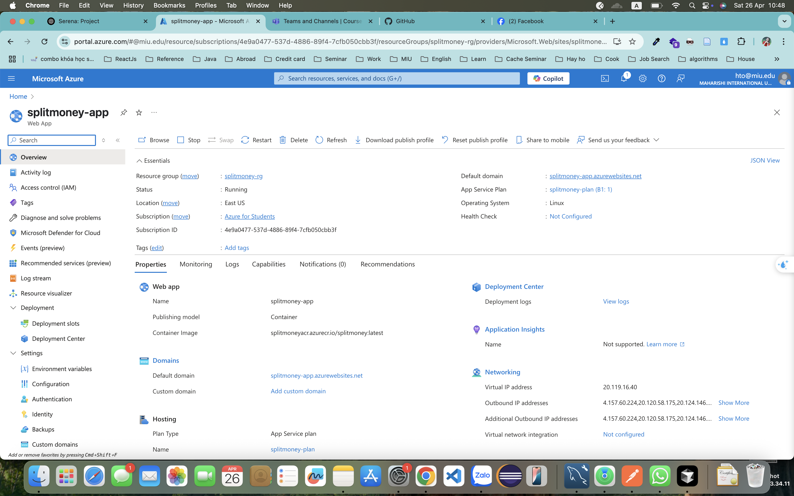

---

## 🧪 Testing

- Run all unit/integration tests:
  ```sh
  npm test
  ```
- Test coverage for user, group, expense logic
- Tests in `backend/src/__tests__` directory

---

## 👨‍💻 Contributors

- [Huong Lan To](https://github.com/HuongLanTo/split-money) — Developer & Project Owner
